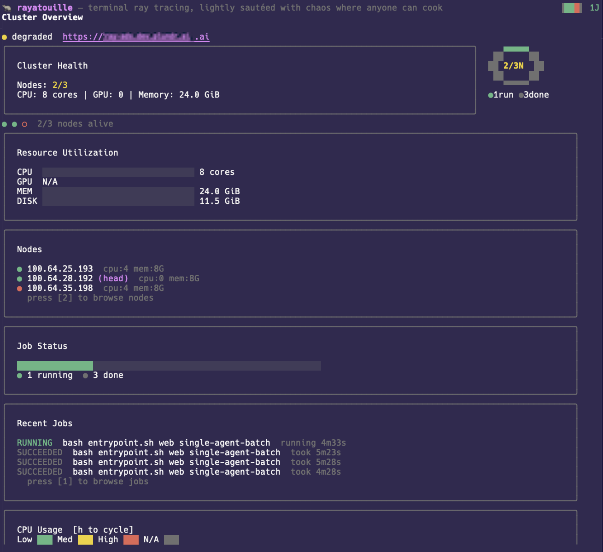
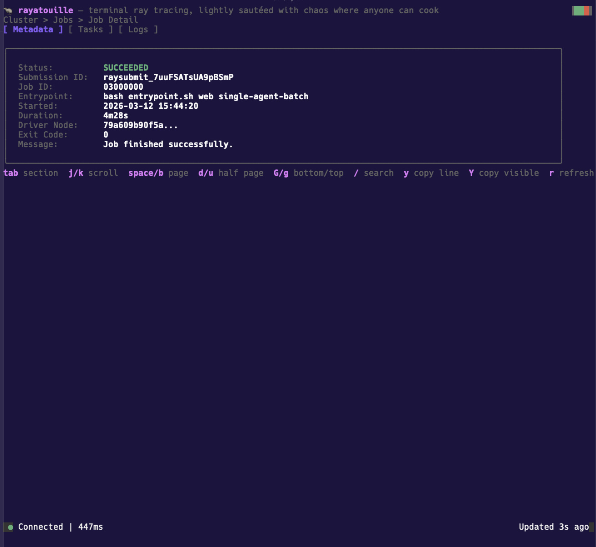

# rayatouille ("_rayaTuI_")

<div align="center">



**A terminal UI for Ray clusters. Because the dashboard shouldn't require a browser.**

_... lightly sautéed with chaos where anyone can cook_ 🍝

</div>

<!-- BEGIN_AUTO_BADGES -->
<div align="center">

[](https://github.com/GangGreenTemperTatum/rayatouille/actions/workflows/ci.yml)
[](https://github.com/GangGreenTemperTatum/rayatouille/actions/workflows/pre-commit.yaml)
[](https://github.com/GangGreenTemperTatum/rayatouille/actions/workflows/release.yml)
[](https://goreportcard.com/report/github.com/GangGreenTemperTatum/rayatouille)
[](https://go.dev/)
[](https://opensource.org/licenses/Apache-2.0)

</div>
<!-- END_AUTO_BADGES -->

---

- [rayatouille ("_rayaTuI_")](#rayatouille-rayatui)
  - [Features](#features)
  - [Install](#install)
  - [Usage](#usage)
    - [Keys](#keys)
    - [Profiles](#profiles)
    - [Config](#config)
    - [Custom keybindings](#custom-keybindings)
    - [Shell completions](#shell-completions)
  - [MCP Server](#mcp-server)
    - [Install](#install-1)
    - [Configure](#configure)
    - [Available Tools](#available-tools)
  - [Development](#development)
  - [Built with](#built-with)
  - [License](#license)
  - [Star History](#star-history)


## Features

- **Dashboard** — cluster health, resource bars, job donut chart, proportional status bar, node heatmap, power bar
- **Jobs** — list with status/sort/filter, drill into metadata, task summary, and scrollable logs
- **Nodes** — list with health indicators, drill into info, actors, and log files
- **Actors** — list all actors, drill into state, metadata, and logs
- **Serve** — view Serve applications, deployments, and replica status
- **Events** — cluster event timeline with severity filtering
- **Command palette** — fuzzy search commands with autocomplete (`:`), type to filter, Tab to cycle and fill
- **Profiles** — save and switch between multiple clusters
- **Custom keybindings** — fully configurable keys with auto-updating hint bar
- **MCP server** — expose Ray cluster data to AI agents via [Model Context Protocol](https://modelcontextprotocol.io)
- **Clipboard** — copy log lines (`y`) or visible page (`Y`) to clipboard
- **Live refresh** — configurable polling interval with latency indicator
- **Hotkey hints** — context-sensitive keybinding hints in every view
- **Keyboard-driven** — vim-style navigation, no mouse needed

## Install

```bash
go install github.com/GangGreenTemperTatum/rayatouille/cmd/rayatouille@latest
```

Or build from source:

```bash
git clone https://github.com/GangGreenTemperTatum/rayatouille.git
cd rayatouille
just build       # or: make build
```

## Usage

```bash
rayatouille --address http://your-ray-cluster:8265

# or set once
export RAY_DASHBOARD_URL=http://your-ray-cluster:8265
rayatouille
```

### Keys

**Global** (work everywhere)

<div>



</div>

| Key | Action |
|-----|--------|
| `1`-`5` | Jump to view (jobs/nodes/actors/serve/events) |
| `Tab` | Cycle views |
| `Esc` | Back |
| `?` | Help overlay |
| `:` | Command palette |
| `q` | Quit |

**List views** (jobs, nodes, actors, serve, events)

| Key | Action |
|-----|--------|
| `j`/`k` | Up/down |
| `Enter` | Drill into selected item |
| `/` | Filter |
| `s` | Cycle sort |

View-specific filter keys:

| View | Keys |
|------|------|
| Jobs | `r` running (default) `f` failed `c` completed `p` pending `a` all |
| Nodes | `l` alive `d` dead `a` all |
| Actors | `l` alive `d` dead `p` pending `a` all |
| Serve | `r` running `d` deploying `f` failed `a` all |
| Events | `e` error `w` warning `i` info `a` all |

**Detail views** (job detail, node detail, actor detail)

| Key | Action |
|-----|--------|
| `Tab` | Cycle sections (metadata/tasks/logs) |
| `j`/`k` | Scroll line by line |
| `space`/`b` | Page down/up |
| `d`/`u` | Half page down/up |
| `G`/`g` | Jump to bottom/top |
| `y` | Copy current line to clipboard |
| `Y` | Copy visible page to clipboard |
| `r` | Refresh |
| `/` | Search logs |
| `n`/`N` | Next/prev match |

**Command palette** (press `:`)

Type to filter, `Tab`/`Down` to cycle and autocomplete, `Enter` to execute.

`:jobs` `:nodes` `:actors` `:serve` `:events` `:dash` `:profile <name>`

### Profiles

```bash
rayatouille profile add prod --address http://ray-prod.example.com
rayatouille profile use prod
rayatouille
```

Switch at runtime with `:profile prod`

### Config

| Flag | Env | Default |
|------|-----|---------|
| `--address` | `RAY_DASHBOARD_URL` | `http://localhost:8265` |
| `--timeout` | -- | `10s` |
| `--refresh-interval` | -- | `5s` |

### Custom keybindings

Create `~/.config/rayatouille/keybindings.json` to override any default key:

```json
{
  "global": {
    "quit": ["ctrl+q"],
    "help": ["?", "F1"]
  },
  "jobs": {
    "running": ["R"],
    "failed": ["F"],
    "sort": ["S"]
  },
  "logging": {
    "copy_line": ["y"],
    "copy_page": ["Y"],
    "search": ["/"],
    "next_match": ["n"],
    "prev_match": ["N"]
  }
}
```

Only specify keys you want to change -- omitted keys keep their defaults. Custom keys are reflected in the hotkey hints bar automatically.

Available sections: `global`, `jobs`, `nodes`, `actors`, `serve`, `events`, `detail`, `logging`.

### Shell completions

```bash
rayatouille completion bash > /etc/bash_completion.d/rayatouille
rayatouille completion zsh > "${fpath[1]}/_rayatouille"
rayatouille completion fish > ~/.config/fish/completions/rayatouille.fish
```

## MCP Server

Rayatouille includes an MCP server that exposes Ray cluster data to AI agents (Claude Code, Cursor, etc.) via the [Model Context Protocol](https://modelcontextprotocol.io).

### Install

```bash
go install github.com/GangGreenTemperTatum/rayatouille/cmd/rayatouille-mcp@latest
```

### Configure

Add to your `.mcp.json` (Claude Code) or equivalent MCP config:

```json
{
  "mcpServers": {
    "rayatouille": {
      "command": "rayatouille-mcp",
      "env": {
        "RAY_DASHBOARD_URL": "http://your-ray-cluster:8265"
      }
    }
  }
}
```

If `RAY_DASHBOARD_URL` is not set, it defaults to `http://localhost:8265`.

### Available Tools

| Tool | Description |
|------|-------------|
| `ray_cluster_health` | Cluster health: version, node counts, resources, job summary |
| `ray_list_jobs` | List all jobs with status, entrypoint, and timing |
| `ray_list_nodes` | List nodes with state, IP, resources, and labels |
| `ray_list_actors` | List actors with state, class, job ID, PID, and node |
| `ray_serve_status` | Serve application status, deployments, and replicas |
| `ray_cluster_events` | Cluster events with severity and timestamps |
| `ray_job_logs` | Get logs for a job by submission ID |
| `ray_task_summary` | Task summary for a job by job ID |
| `ray_node_logs` | List available log files for a node |
| `ray_node_log_file` | Get contents of a specific node log file |
| `ray_actor_logs` | Get stdout logs for an actor |

## Development

```bash
just check          # fmt + lint + test (all-in-one)
just build          # build binary
just test           # unit tests
just test-e2e       # e2e against live cluster
just lint           # go vet + golangci-lint
just fmt            # format
just run --address http://your-cluster:8265
```

Or use `make` -- same targets.

## Built with

[Go](https://go.dev) / [Bubble Tea](https://github.com/charmbracelet/bubbletea) / [Lip Gloss](https://github.com/charmbracelet/lipgloss) / [Cobra](https://github.com/spf13/cobra) / [MCP Go SDK](https://github.com/modelcontextprotocol/go-sdk) / [Ray Dashboard API](https://docs.ray.io/en/latest/cluster/dashboard.html)

---

*Anyone can cook. Anyone can monitor their Ray cluster.*

## License

This project is licensed under the Apache License 2.0 - see the
[LICENSE](LICENSE) file for details.

## Star History

[](https://github.com/GangGreenTemperTatum/rayatouille/stargazers)

By watching the repo, you can also be notified of any upcoming releases.

[](https://star-history.com/#GangGreenTemperTatum/rayatouille&Date)
